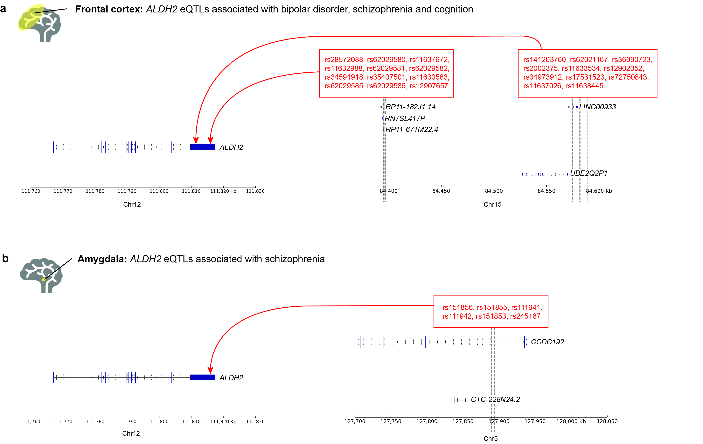

# *ADH* and *ALDH* gene regulation

This repository contains scripts, data, results, figures and reproducibility report for "*ADH* and *ALDH* gene regulation" study.

Cell type- and tissue-specific Hi-C data is available on [GEO](https://www.ncbi.nlm.nih.gov/geo/) or [ENCODE](https://www.encodeproject.org/) databases (GSE77565, GSE105194, GSE105513, GSE105544, GSE105914, GSE52457, GSE105957, GSE35156, GSE43070, GSE35156, GSE43070, GSE63525, GSE105235, GSE105275, GSE105318, GSE105465, GSE105491, GSE105556, GSE105557, GSE105566, GSE105600, GSE105697, GSE105710, GSE105725, GSE105988, GSE106015, GSE106022, GSE92819, GSE126199, GSE105381, ENCSR504OTV, ENCSR479USL, GSE134761, GSE115491, GSE122958, GSE105776, GSE98161, GSE87112, ENCSR748LQF). RNA-seq and genotyping data (GTEx v8) are available via [dbGaP access](https://www.ncbi.nlm.nih.gov/projects/gap/cgi-bin/study.cgi?study_id=phs000424.v8.p2) (phs000424.v8.p2). Human genome build hg38 release 75 (GRCh38) (Homo_sapiens_assembly38_noALT_noHLA_noDecoy.fasta) was downloaded from [gs://gtex-resources](https://console.cloud.google.com/storage/browser/gtex-resources/references). SNP genomic positions for genome GRCh38p7 build 151 were obtained from the [dbSNP ftp site](ftp://ftp.ncbi.nih.gov/snp/organisms/human_9606_b151_GRCh38p7). Gene annotations for GENCODE v26 (gencode.v26.GRCh38.genes.gtf) were downloaded from [gs://gtex-resources](https://console.cloud.google.com/storage/browser/gtex-resources/references). 

Python (version 3.6.9), R (version 4.0.2) and RStudio (version 1.2.5033) were used for data processing, analysis and visualisation. 